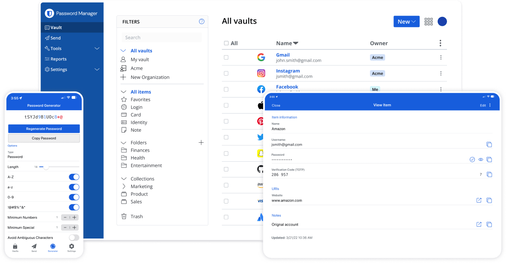

<!--
Este archivo README esta generado automaticamente<https://github.com/YunoHost/apps/tree/master/tools/readme_generator>
No se debe editar a mano.
-->

# Vaultwarden para Yunohost

[](https://ci-apps.yunohost.org/ci/apps/vaultwarden/)


[](https://install-app.yunohost.org/?app=vaultwarden)

*[Leer este README en otros idiomas.](./ALL_README.md)*

> *Este paquete le permite instalarVaultwarden rapidamente y simplement en un servidor YunoHost.*  
> *Si no tiene YunoHost, visita [the guide](https://yunohost.org/install) para aprender como instalarla.*

## Descripción general

Vaultwarden is a password manager, allowing generation and storage of passwords in a secure way. These are protected by a single password called the "master password".

Clients exist for [Linux, macOS and Windows](https://bitwarden.com/#download), [Android](https://play.google.com/store/apps/details?id=com.x8bit.bitwarden), [iOS](https://itunes.apple.com/app/bitwarden-free-password-manager/id1137397744?mt=8), and as a web browser plug-ins. It is also possible to manage passwords from the web interface.


**Versión actual:** 1.33.2~ynh1

**Demo:** <https://vault.bitwarden.com/#/register>

## Capturas



## Documentaciones y recursos

- Documentación usuario oficial: <https://help.bitwarden.com/>
- Documentación administrador oficial: <https://github.com/dani-garcia/vaultwarden/wiki>
- Repositorio del código fuente oficial de la aplicación : <https://github.com/dani-garcia/vaultwarden>
- Catálogo YunoHost: <https://apps.yunohost.org/app/vaultwarden>
- Reportar un error: <https://github.com/YunoHost-Apps/vaultwarden_ynh/issues>

## Información para desarrolladores

Por favor enviar sus correcciones a la [rama `testing`](https://github.com/YunoHost-Apps/vaultwarden_ynh/tree/testing).

Para probar la rama `testing`, sigue asÍ:

```bash
sudo yunohost app install https://github.com/YunoHost-Apps/vaultwarden_ynh/tree/testing --debug
o
sudo yunohost app upgrade vaultwarden -u https://github.com/YunoHost-Apps/vaultwarden_ynh/tree/testing --debug
```

**Mas informaciones sobre el empaquetado de aplicaciones:** <https://yunohost.org/packaging_apps>
